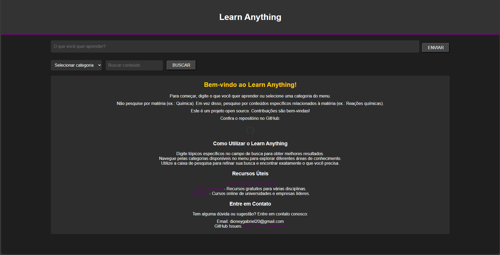
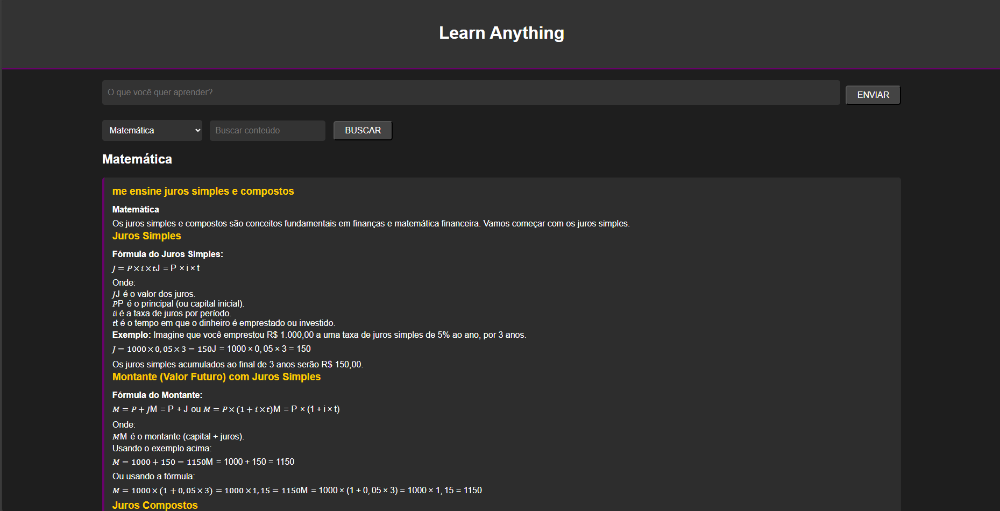

<div align="center">
    <h1>Learn Anything</h1>
    <p><strong>Learn Anything</strong> é um projeto open source que permite aos usuários pesquisar e aprender sobre diversos tópicos escolares usando o ChatGPT (Sem api, utilizamos WebScrap).</p>
</div>



## IMPORTANTE

Ao iniciar o sistema, abrira uma sessao do navegador, faça login em uma conta, e caso o Cloudflare barre a aplicaçao, abra uma nova guia, acesse o `chat.openai.com` e faca a validaçao, assim voce fica livre por um longo tempo!

## Funcionalidades

- Fazer perguntas e obter respostas detalhadas.
- Selecionar categorias específicas para filtrar o conteúdo.
- Buscar por palavras ou frases específicas dentro das respostas.
- Interface intuitiva e responsiva.
- Manutenção da sessão do navegador para melhorar a eficiência.

### Requisitos

- Python 3.6 ou superior
- Django 3.0 ou superior
- Selenium
- Microsoft Edge WebDriver (já esta nos arquivos <3)
- Navegador Edge

### Passos para Instalação

1. Clone o repositório:

    ```bash
    git clone https://github.com/SimpleDioney/learn-anything.git
    cd learn-anything
    ```

2. Crie um ambiente virtual e instale as dependências:

    ```bash
    python -m venv venv
    source venv/bin/activate  # No Windows use `venv\Scripts\activate`
    pip install -r requirements.txt
    ```

3. Acesse: `learn/views.py` acesse `options.add_argument("user-data-dir=C:/Users/SEU_USUARIO/AppData/Local/Microsoft/Edge/User Data/Selenium")` e troque `SEU_USUARIO` para o usuario de seu computador.

4. Execute as migrações do banco de dados:

    ```bash
    python manage.py makemigrations
    python manage.py migrate
    ```

5. Crie um usuario admin:
   ```bash
   python manage.py createsuperuser
   ```

6. Inicie o servidor de desenvolvimento:

    ```bash
    python manage.py runserver
    ```
    
7. Abra o navegador e acesse `http://127.0.0.1:8000/` para ver o aplicativo em ação.

## Como Usar

### Interface de Usuário

- **Perguntar**: Digite a pergunta na barra de pesquisa e clique em "Enviar". A resposta será exibida abaixo.
- **Selecionar Categoria**: Use o menu dropdown para selecionar uma categoria específica e ver todas as perguntas e respostas relacionadas.
- **Buscar**: Utilize a barra de busca para procurar por palavras ou frases específicas nas respostas.

### Manipulação da Base de Dados

- **Administração**: Acesse o painel administrativo em `http://127.0.0.1:8000/admin` para gerenciar as perguntas, respostas e categorias.
- **Adicionar Categoria**: As categorias são adicionadas automaticamente com base na resposta do ChatGPT. Caso precise adicionar manualmente, vá ao painel admin e adicione uma nova categoria.

## Contribuições

Contribuições para melhorar GitBrowse são sempre bem-vindas! Para contribuir:

1. Faça um fork do repositório.
2. Crie um novo branch para sua feature ou correção:
   ```bash
   git checkout -b minha-feature
   ```
3. Desenvolva e teste suas mudanças.
4. Envie um pull request:
   ```bash
   git push origin minha-feature
   ```

## Apoio

Para apoiar o desenvolvimento contínuo e melhorias, considere tornar-se um patrocinador no Patreon:
[](https://patreon.com/SimpleDioney)

## Licença

Distribuído sob a licença MIT. Veja o arquivo `LICENSE` para mais detalhes.
